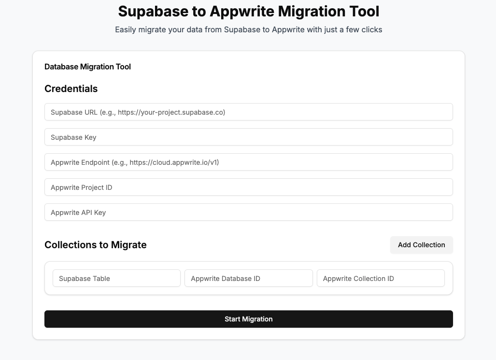

# Supabase to Appwrite Migration Tool

A powerful, user-friendly tool to migrate your data from Supabase to Appwrite with automatic schema analysis and creation.



## Features

- 🚀 **Automatic Schema Analysis**: Detects Supabase table structure and creates matching Appwrite attributes
- 🔄 **Seamless Data Migration**: Transfers your data with proper type conversion and field mapping
- 📊 **Real-time Progress Tracking**: Visualizes migration progress with detailed statistics
- 🛑 **Cancellation Support**: Safely stop migrations in progress
- 🧪 **Schema Validation**: Ensures data compatibility before migration
- 🔐 **Secure Credential Handling**: Properly manages API keys and credentials
- 🎯 **Batch Processing**: Efficiently handles large datasets
- ⚡ **TypeScript Support**: Built with type safety in mind

## Getting Started

### Prerequisites

- Node.js 16.x or higher
- npm or yarn
- A Supabase project with data you want to migrate
- An Appwrite project to migrate to

### Installation

```bash
# Clone the repository
git clone https://github.com/yourusername/supabase-to-appwrite.git

# Navigate to the project directory
cd supabase-to-appwrite

# Install dependencies
npm install

# Start the development server
npm run dev
```

## Usage Guide

### 1. Prepare Your Appwrite Project

Before starting the migration:

1. Create an Appwrite project
2. Create a database in Appwrite
3. Create an API key with the following permissions:
   - `collections.read`
   - `documents.write`
   - `attributes.write`

### 2. Enter Credentials

In the migration tool:

1. Enter your Supabase URL (e.g., `https://yourproject.supabase.co`)
2. Enter your Supabase anon key
3. Enter your Appwrite endpoint (e.g., `https://cloud.appwrite.io/v1`)
4. Enter your Appwrite project ID
5. Enter your Appwrite API key

### 3. Set Up Collection Mapping

For each Supabase table you want to migrate:

1. Enter the Supabase table name
2. Enter the Appwrite database ID
3. Enter the Appwrite collection ID

You can add multiple collection mappings by clicking "Add Collection".

### 4. Analyze Schema

For each collection mapping:

1. Click "Analyze & Create Schema"
2. The tool will:
   - Analyze your Supabase table structure
   - Detect field types and constraints
   - Create matching attributes in your Appwrite collection
   - Show you which fields were detected and created

### 5. Start Migration

Once schema analysis is complete:

1. Click "Start Migration"
2. Monitor the progress through:
   - Progress bar showing completion percentage
   - Logs showing migration status
   - Success/error counting

If needed, you can cancel the migration by clicking "Cancel Migration".

## Understanding the UI

### Credentials Form
Enter your Supabase and Appwrite credentials here. All fields are required.

### Collection Mapping
Map your Supabase tables to Appwrite collections. You can add multiple mappings.

### Schema Analyzer
Analyzes and creates schema for each collection mapping. This step must be completed before migration.

> **Note**: For detailed information about how the Schema Analyzer works, please see [SCHEMA_ANALYZER.md](SCHEMA_ANALYZER.md)

### Progress Tracking
During migration, shows:
- Current collection being migrated
- Number of records processed
- Percentage complete
- Visual progress bar

### Logs
Shows detailed logs about the migration process:
- Schema analysis results
- Migration progress updates
- Success and error messages

## Troubleshooting

### Common Issues

#### "Failed to get collection schema"
- Ensure your Appwrite API key has `collections.read` permission
- Verify the Appwrite database ID and collection ID are correct

#### "Invalid document structure"
- Run the schema analysis again to ensure all fields exist in Appwrite
- Check for data type mismatches

#### "Migration process failed"
- Check your network connection
- Verify your credentials are correct
- Ensure your Appwrite project has sufficient storage

### Documentation

- **[SCHEMA_ANALYZER.md](SCHEMA_ANALYZER.md)**: Detailed documentation on the schema analyzer component
- **README.md**: This file, with general usage instructions

### Advanced Configuration

For more advanced configurations, check the following files:

- `src/components/database-migration/index.tsx`: Main migration logic
- `src/components/database-migration/schema-analyzer.tsx`: Schema analysis logic
- `src/lib/types.ts`: Type definitions

## Contributing

Contributions are welcome! Please read our [Contributing Guide](CONTRIBUTING.md) for details on our code of conduct and the process for submitting pull requests.

## License

This project is licensed under the MIT License - see the [LICENSE](LICENSE) file for details.

## Acknowledgments

- Built with React, TypeScript, and Next.js
- UI components from shadcn/ui
- Styling with Tailwind CSS

---

Made with ❤️ by [@itsallan](https://github.com/itsallan). Happy migrating!